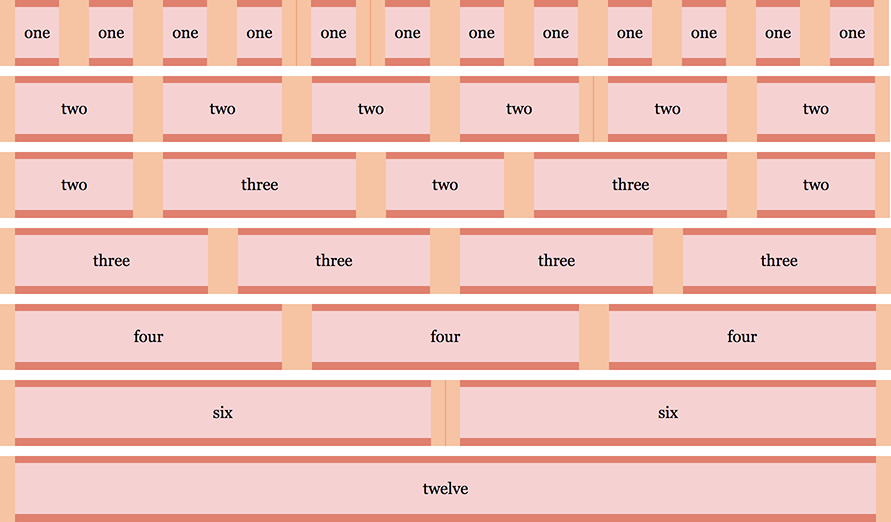

# cf-grid

[](https://travis-ci.org/cfpb/cf-grid) 

A Less-based CSS3 grid system using parametric mixins to encourage semantic HTML.
This component can be used by itself, but it was made for Capital Framework,
a new front end framework developed at the
[Consumer Financial Protection Bureau](https://cfpb.github.io/).

cf-grid has four main features:

1. Provides fixed-width gutters and fluid-width columns.
2. Works seamlessly with any combination of grid and gutter widths.
3. Keeps HTML semantic by not including presentational classes in markup.
4. Row-agnostic. Put as many columns as you want in a container. Great for RWD.

- [View the docs](https://cfpb.github.io/cf-grid/docs/)
- [See the custom demo](https://cfpb.github.io/cf-grid/custom-demo/)

The current version number can be found in [bower.json](bower.json#L3)
and follows [Semantic Versioning 2.0](http://semver.org/).
Release notes are recorded on the
[Releases page](https://github.com/cfpb/cf-grid/releases/).

If you would like to take advantage of more components or if you're new to
Capital Framework, we encourage you to [start here](https://cfpb.github.io/capital-framework/).




## Dependencies

`boxsizing.htc` is needed if you wish to support IE7 and lower.
It will automatically get installed when running `grunt vendor`.
Once installed you need to override the `@box-sizing-polyfill-path` Less variable
to point to the installed `boxsizing.htc` file using a root relative path.


## How to use this component

Detailed instructions can be found in the Capital Framework
[documentation site](https://cfpb.github.io/capital-framework/components/).


### Usage example

Instead of:

```html
<header class="row">
    <aside class="span4">
        Lorem ipsum Ut deserunt do nostrud. 
    </aside>
    <section class="span8">
        Lorem ipsum Voluptate pariatur Duis fugiat cupidatat quis pariatur.
    </section>
</header>
```

cf-grid allows you to write:

```html
<header>
    <aside class="welcome-message">
        Lorem ipsum Ut deserunt do nostrud. 
    </aside>
    <section class="customer-info">
        Lorem ipsum Voluptate pariatur Duis fugiat cupidatat quis pariatur.
    </section>
</header>
```

Using Less that looks like this:

```less
.welcome-message {
  .grid_column(4);
}

.customer-info {
  .grid_column(8);
}
```

**Note:**
This functionality is optional and you can use cf-grid in generated mode
(i.e., with traditional `.col-#` classes) by compiling `cf-grid-generated.less`.


## Known Issues

* **Rounding and Rendering** –
  Certain browsers (most notably Safari, and IE7) either (a) have poor precision when 
  rounding percentage values, (b) don't support subpixel rendering, or both.
  Usually this results in rows with  large numbers of columns rendering "short"
  (i.e., not stretching all the way to the right).
* **IE10 inline-block whitespace not completely removed** –
  Because IE10 no longer supports
  [Conditional Comments](http://msdn.microsoft.com/en-us/library/ms537512(v=vs.85).aspx),
  the slight increase to `margin-right` on the column mixin that gets it to behave in every other IE
  no longer works.
  This only manifests as a problem on rows with very many columns,
  which is not likely to happen in real-world layout scenarios, 
  so we are electing to ignore the issue at this time.
* **Prefix/Suffix not supported in IE7** –
  It doesn't seem to be able to handle percentage-based padding.
* **Compiled CSS can be very large** –
  If you're using the generated mode (where all of the classes are generated for you),
  it is essential that static assets are served gzipped,
  which can reduce the filesize of repetitive CSS dramatically (on the order of 90%).


## Getting involved

We welcome your feedback and contributions.

- [Find out about contributing](CONTRIBUTING.md)
- File a bug using this [handy template](https://github.com/cfpb/cf-grid/issues/new?body=%23%23%20URL%0D%0D%0D%23%23%20Actual%20Behavior%0D%0D%0D%23%23%20Expected%20Behavior%0D%0D%0D%23%23%20Steps%20to%20Reproduce%0D%0D%0D%23%23%20Screenshot&labels=bug)


----

## Open source licensing info
1. [TERMS](TERMS.md)
2. [LICENSE](LICENSE)
3. [CFPB Source Code Policy](https://github.com/cfpb/source-code-policy/)


----

## Credits and references

Docs built with the excellent [Topdoc](https://github.com/topcoat/topdoc/).
